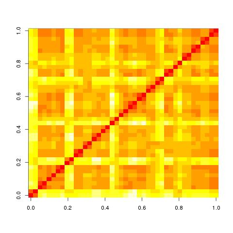

# ndmg

NeuroData's MR Graphs package, **ndmg** (pronounced "***nutmeg***"), is the successor of the MRCAP, MIGRAINE, and m2g pipelines. **ndmg** combines dMRI and sMRI data from a single subject to estimate a high-level connectome reliably and scalably.

We are processing brain scans on an ongoing basis, and the resulting graphs are made available to the community through our [graph database](http://openconnecto.me/graph-services/).

## Getting Started
This tutorial will lead you through installing the **ndmg** package and lead you all along the way to using one of the pre-made end-to-end pipelines for connectome estimation from diffusion and structural MRI.

### Installing ndmg
Installing **ndmg** is very simple! We have a few dependencies which must be installed, but once that's taken care of you are ready to dive in!

**ndmg** relies on: [FSL](http://fsl.fmrib.ox.ac.uk/fsl/fslwiki/FslInstallation), [DiPy]http://nipy.org/dipy/(), [igraph](http://igraph.org/python/), and [nibabel](http://nipy.org/nibabel/) primarily, as well as more standard libraries such as [numpy](http://www.numpy.org/) and [scipy](http://www.scipy.org/). You should install FSL through the instructions on their website. Then, you can install **ndmg** with the following command and it'll handle the rest:

    pip install ndmg

### Readying your data
Once **ndmg** is installed, the next thing you need to do is track down your data. If you don't have data readily available, you can [borrow some of ours](http://openconnecto.me/mrdata/share/demo_data.zip). The data you'll need are the following:

- 1 MPRAGE image
- 1 DTI image
- 1 DTI b-values file
- 1 DTI b-vectors file

In the interest of comparing results, **ndmg** performs operations in a predefined *atlas* space. In order for this to work you'll need, who would've guessed, an atlas! We recommend the MNI152 atlas and the Desikan parcellation, and you can [download them here](http://openconnecto.me/mrdata/share/atlas.zip) (if you've downloaded the demo data you're good to go - we thought ahead).

**ndmg** expects the DTI and MPRAGE images in a nifti format, and the b-values and b-vectors files to be ASCII text files with the extensions `.bval` and `.bvec`, respectively. If you are unsure if you data is formatted correctly, please feel free to [download our demo data](http://openconnecto.me/mrdata/share/demo_data.zip) and check for yourself!

### Using ndmg
Now that your data is all set and ready to use, let's put **ndmg** to work! Let's give our end-to-end pipeline a shot. We're going to assume that you are using our demo data and you've stored it in your home directory. Open a new terminal and type the following:

    python ndmg_pipeline.py ~/data/KKI2009_113_1_DTI.nii ~/data/KKI2009_113_1_DTI.bval ~/data/KKI2009_113_1_DTI.bvec ~/data/KKI2009_113_1_MPRAGE.nii ~/atlas/MNI152_T1_1mm.nii.gz ~/atlas/MNI152_T1_1mm_brain_mask.nii.gz ~/data/outputs ~/atlas/desikan.nii.gz

To break that down a bit, let's look at the arguments specifically:

    python ndmg_pipeline.py dti bval bvec mprage atlas mask outdir [labels [labels ...]]

Let's chat about the things that might look a little funny here. `mask` is a binary mask (i.e. black and white) image of the brain in the atlas you're using. `outdir` is the base directory where you want your output files to be stored - don't worry, **ndmg** will handle the naming and organization within. Lastly, notice that `[labels [labels ...]]` block at the end? That means that **ndmg** allows you to make connectomes on multiple scales and parcellation schemes at once, you just need to pass in all of the sets of labels you'd like to use!

### Waiting for your results
The **ndmg** end-to-end pipeline takes about 30 minutes to run on my computer (a pretty basic Macbook), and feeds you output statements along the way.

### Diving deeper
Sure, the above gave you a taste of what the **ndmg** package can do, but what if you want a bit more of an intimiate knowledge of the inner workings of that pipeline we just showed? Well, you're in luck! Check out this [Jupyter Notebook](./examples/run_ndmg.ipynb) that walks you through what the pipeline you just ran is doing.

### Validation on KKI42 Dataset
Our v0.0.1 version of ndmg achieved excellent (although not quite perfect) TRT.  This is in active development.

    [1] "Computing test-retest reliability with the following options:"
    [1] "m2g location: /share0/m2g/src/m2g"
    [1] "Number of rois: 70"
    [1] "Graph format: graphml"
    [1] "Number of scans per subject: 2"
    [1] "Total number of graphs found: 42"
    [1] "Number of graphs which failed to load:  0"
    [1] "Graphs with improper dimensions:  0"
    [1] "Graphs with less than 1e+05 edges: 0"
    [1] "Remaining graphs available for processing: 42"
    [1] "Graphs with reliability < 0.5 (outliers): 0"
    [1] "Graphs with unique ids: 0"
    [1] "Graphs available for reliability analysis: 42"
    [1] "MNR: 0.999404761904762"

## Questions?
If you're having trouble, notice a bug, or want to contribute (such as a fix to the bug you may have just found) feel free to open a git issue or pull request. Enjoy!
