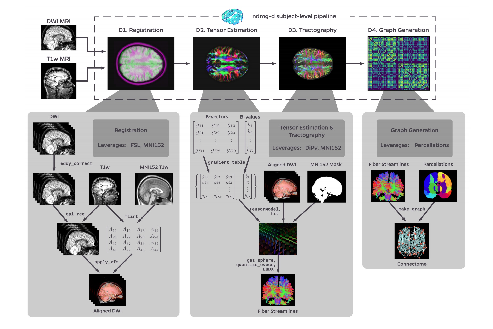

******************
Diffusion Pipeline
******************

.. contents:: Table of Contents

Here we take a deep-dive into the modules of the `NDMG-d` pipeline. We will explain algorithm and parameter choices that were implemented at each step and the justification for why they were used over alternatives.

Output Summary Table
====================

.. list-table:: `NDMG-d` **IO Breakdown**. Below, we look at the inputs, outputs, and QA figures produced by `NDMG-d`.
    :widths: 10 5 10 50
    :header-rows: 1
    :stub-columns: 0

    * - Step
      - Inputs
      - Outputs
      - QA figures
    * - Registration
      - raw dMRI, raw T1w, template
      - aligned dMRI
      - Figure S2
    * - Tensor Estimation
      - aligned dMRI
      - tensor field
      - Figure S3
    * - Tractography
      - tensor field
      - fiber tracts
      - 
    * - Graph Generation
      - fiber tracts, parcellations
      - connectome
      - Figure S4

Output subject-level pipeline summary
=====================================

    Figure S1: `NDMG-d` **detailed pipeline**. The `NDMG-d` pipeline consists of 4 main steps: Registration (**D1**), Tensor Estimation (**D2**), Tractography (**D3**), and Graph Generation (**D4**). Each of these sections leverages publicely available tools and data to robustly produce the desired derivative of each step. Alongside derivative production, `NDMG` produces QA figures at each stage, as can be seen in **D1-4**, that enable qualitative evaluation of the pipeline's performance.

Registration
============

Registration in `NDMG` leverages FSL and the Nilearn Python package. `NDMG` uses linear registrations because non-linear methods had higher variability across studies and increased the time requirements of the pipeline dramatically.

The first step in the registration module is eddy-current correction and dMRI self-alignment to the volume-stack's BO volume (Figure S1). `NDMG` uses FSL's ``eddy_correct``, rather than the newer ``eddy`` function, because ``eddy`` requires substantially longer to run or relies on GPY acceleration, which would reduce the accessibility of `NDMG`. Once the dMRI data is self-aligned, it is aligned to the same-individual T1w image through FSL's ``epi_reg`` mini-pipeline. This tool performs a linear alignment between each image in the dMRI volume-stack and the T1w volume. The T1w volume is then aligned to the MNI152 template using linear registration computed by FSL's ``flirt``. This alignment is computed using the 1 millimeter (mm) MNI152 atlas, to enable higher freedom in terms of the parcellations that may be used, such as near-voxelwise parcellations that have been generated at 1 mm. FSL's non-linear registration, ``fnirt``, is not used in `NDMG` as the performance was found to vary significantly based on the collection protocol of the T1w images, often resulting in either slightly improved or significantly deteriorated performance.

The transform mapping the T1w volume to the template is then applied to the dMRI image stack, resulting in the dMRI image being aligned to the MNI152 template in stereotaxic-coordinate space. However, while ``flirt`` aligns the images in stereotaxic space, it does not guarantee an overlap of the data in voxelspace. Uisng Nilearn's ``resample``, `NDMG` ensures that images are aligned in both voxel- and stereotaxic-coordinates so that all analyses can be performed equivalently either with or without considering the image affine-transforms mapping the data matrix to the real-world coordinates.

Finally, `NDMG` produces a QA plot showing three slices of the first BO volume of the aligned dMRI image overlaid on the MNI152 template in the three principle coordinate planes (Figure S2).

.. figure:: ../_static/registration-qa.png
    :align: left
    :figwidth: 700px

    Figure S2: `NDMG-d` **Registration QA**. `NDMG-d` produces registration QA showing the zeroth slice of the dMRI sequence in green overlaid on the template brain in purple.

Tensor Estimation
=================

.. _DiPy: http://nipy.org/dipy/examples_built/reconst_dti.html

Once the dMRI volumes have been aligned to the template, `NDMG` begins diffusion-specific processing on the data. All diffusion processing in `NDMG` is performed using the DiPy Python package. The diffusion processing in `NDMG` is performed after alignment to ease cross-connectome comparisons.

While high-dimensional diffusion models, such as orientation distribution functions (ODFs) or q-ball, enable reconstruction of crossing fibers and complex fiber trajectories, these methods are designed for images with a large number of diffusion volumes/directions for a given image. Because `NDMG` is designed to be robust across a wide range of dMRI studies, including diffusion tensor imaging, `NDMG` uses a lower-dimensional tensor model. The model, described in detail on DiPy_'s website, computes a 6-component tensor for each voxel in the image. This reduces the dMRI image stack to a single 6-dimensional image that can be used for tractography. `NDMG` generates a QA plot showing slices of the FA map derived from the tensors in nine panels, as below (Figure S3)

.. figure:: ../_static/tensor-qa.png
    :align: left
    :figwidth: 700px

    Figure S3: `NDMG-d` **Tensor Estimation QA**. `NDMG-d` produces tensor QA showing the voxelwise deterministic tensor model fit to the aligned dMRI sequence.

Tractography
=============

`NDMG` uses DiPy's deterministic tractography algorithm, ``EuDX``. Integration of tensor estimation and tractography methods is minimally complex with this tractography method, as it has been designed to operate on the tensors produced by DiPy in the previous step. Probabilistic tractography would be significantly more computationally expensive, and it remains unclear how well it would perform on data with a small number of diffusion directions. The QA figure for tractography shows a subset of the resolved streamlines in an axial projection of the brain mask with the fibers contained therein (Figure S4). This QA figure allows the user to verify, for example, that streamlines are following expected patterns within the brain and do not leave the boundary of the mask.

Graph Estimation
================

`NDMG` uses the fiber streamlines to generate connectomes across multiple parcellations. Graphs are formed by contracting voxels into graph vertices depending on spatial, anatomical, or functional similarity. Given a parcellation with vertices :math:`V` and a corresponding mapping :math:`P(v_i)` indicating the voxels within a region :math:`i`, we contract our fiber streamlines as follows. To form a graph :math:`G(V, E, w)`, we know that :math:`V = \left\{v_i\right\}_{i=1}^N` is the set of all unique vertices in our parcellation. :math:`E = V \times V` is a collection of possible edges between different vertex regions. :math:`w : V \times V \to \mathbb{Z}_+` is a weighting function for each edge in the graph. Here, :math:`w(v_i,v_j) = \sum_{w \in P(v_j)}{\sum_{w \in P(v_i)}\mathbb{i}\left\{F_{u,w}\right\}}` where :math:`F_{u,w}` is true if a fiber tract exists between voxels :math:`u` and :math:`w`, and false if there is no fiber tract between voxels :math:`u` and :math:`w`.

The connectomes generated are graph objects, with nodes in the graph representing regions of interest (ROIs) and edges representing connectivity via fibers. An undirected edge is added to the graph for each pair of ROIs a given streamline passes through. Edges are undirected because dMRI data lacks direction information. Edge weight is the number of streamlines which pass through a given pair of regions. `NDMG` uses 24 parcellations, including all standard public dMRI parcellations known by the authors. Users may run `NDMG` using any additional parcellation defined in MNI152 space simply by providing access to it on the command-line. To package an additional parcellation with `NDMG`, please contact the maintainers. The QA for graph generation depicts a number of graph statistics for each of the parcellation schemes. We typically generate this figure at the population level, as depicted in Figure S4.
