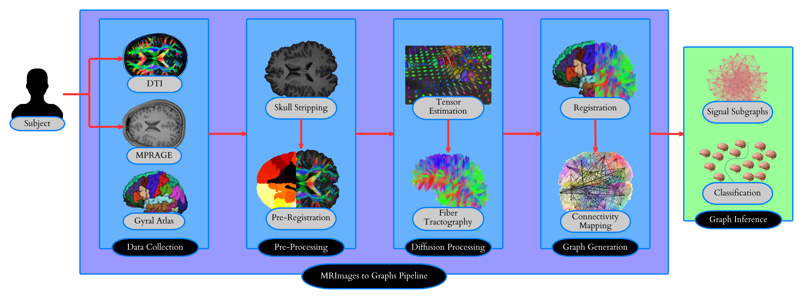

Introduction
************

The ability to estimate a connectome, i.e. a description of connectivity in the brain of an individual, promises advances in many areas from personalized medicine to learning and education, and even to intelligence analysis. A robust analysis of these brain-graphs is on the horizon due to recent efforts to collect large amounts of multimodal magnetic resonance imaging data.An ideal methodology would enable scalable computing of graphs and functionals thereof in a way that yields estimates that are reliable. Moreover, such a tool would be open source, and make the data it processes open source in a user friendly way.  

Building such a tool, however, is challenging.  The data for each subject consists of about 1 gigabyte (GB) of data.  Converting from raw data to graphs and functions thereof requires daisy-chaining over 20 subroutines, each of which implements a different transformation of the data.  The utility of the output brain-graphs is a function of its scientific meaningfulness.  Because such data currently lack ground truth for the estimates, or even other gold standards, investigators are left to assess the quality of estimates using only the data itself.  Test-retest datasets consist of multiple subjects, each of whom have been scanned multiple times. Most previous work on reliability has assessed parametric reliability of features of the data.  For example, it is standard to compare the between and within variances of, say, the number of edges.  However, these approaches are limited because they make parametric assumptions, and test scalar functions of the graphs.

We present here a new pipeline for estimating Graphs from MR images, called M2G. In addition to satisfying the above two mentioned desiderata (scalability and reliability), our pipeline, and much of our data, are provided in accordance with open science.

The ability to ''classify'' an individual's connectome further allows for inferring characteristics of an individual based on the degree to which his or her patterns of brain connectivity align with those observed in cohorts having known properties or outcomes, such as gender, handedness, intelligence, the ability to learn a foreign language, psychological impairments, disease susceptibility, etc.  

The primary contribution of our efforts is the creation of a robust, high-throughput pipeline for estimating connectomes, beginning with diffusion MR images and MPRAGE structural data and ending with both small (70 vertex) , and big (1 million) vertex brain graphs.  Further, we have made enhancements to the pipeline that include validation and analysis algorithms (e.g. graph embedding) to enable high-throughput, end-to-end solutions.

TODO
- read and update (see asana comments) [G]
- simplify and explain picture [G]
