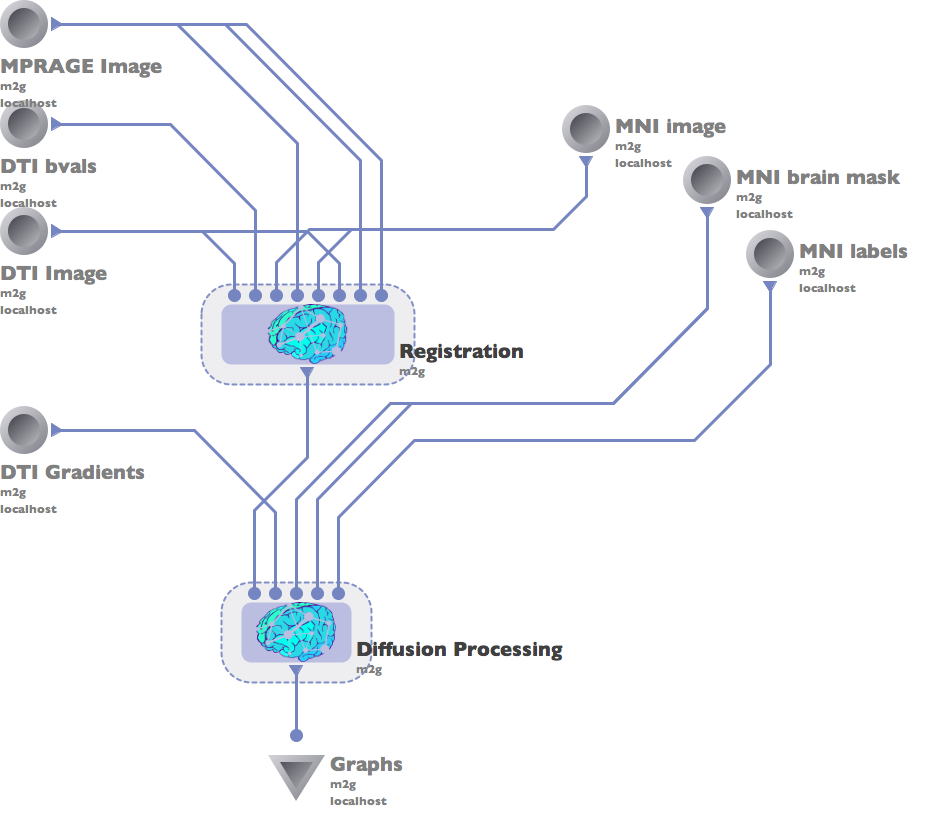
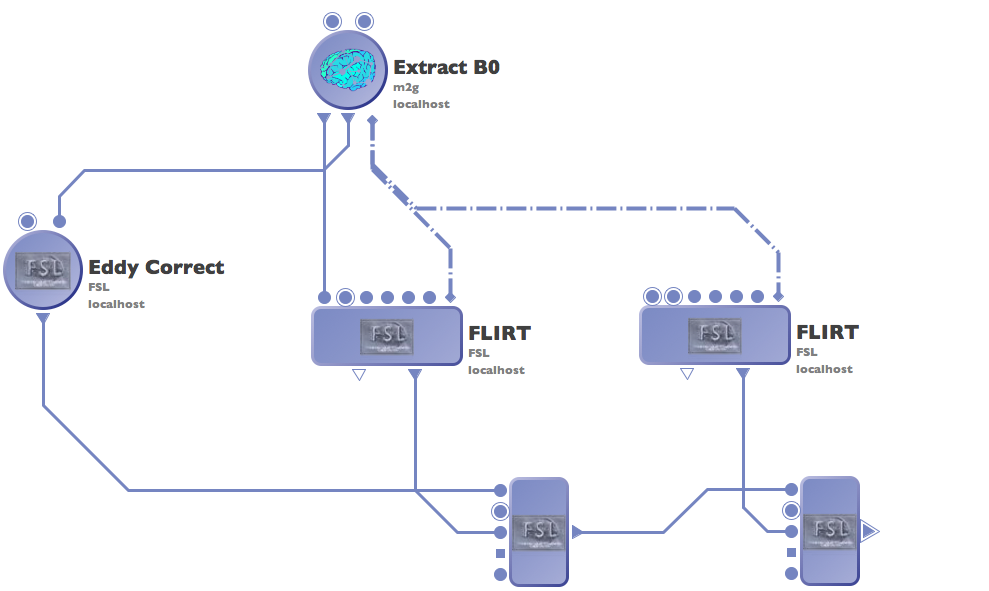
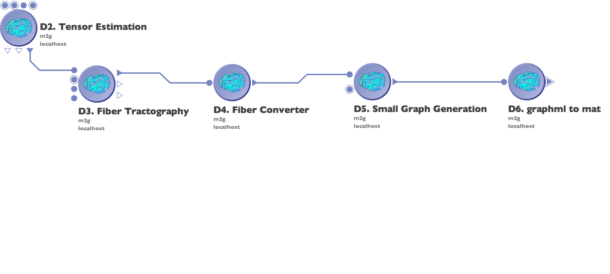
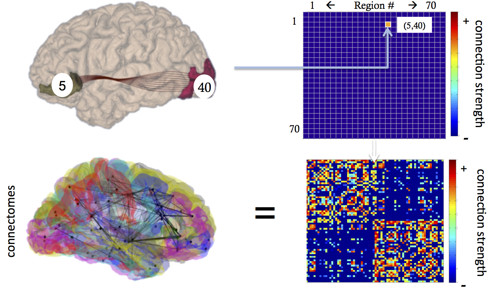

Basic Usage
***********

m2g is a 'one-click' pipeline which can estimate brain graphs from diffusion and structural MRI data. Provided here are an overview of the function and usage of the entire m2g pipeline, as well as the two sub-pipelines which make up m2g: the registration and diffusion processing pipelines.

m2g Complete Pipeline
~~~~~~~~~~~~~~~~~~~~~

.. autofunction:: docs.scripts.m2g

m2g Registration Pipeline
~~~~~~~~~~~~~~~~~~~~~~~~~

.. autofunction:: docs.scripts.m2g_registration

m2g Diffusion Processing Pipeline
~~~~~~~~~~~~~~~~~~~~~~~~~~~~~~~~~

.. autofunction:: docs.scripts.m2g_diffusion

Intuition Behind Graph Generation
~~~~~~~~~~~~~~~~~~~~~~~~~~~~~~~~~
To generate a graph, we first form an empty graph (A), with rows and columns corresponding to nodes (atlas regions).  For each fiber streamline, we find all connected regions; for each pair of regions (i,j) in the streamline, we increment the A(i,j).  Because these connections are undirected, we also increment A(j,i) - or equivalently store only the upper triangular matrix. 

